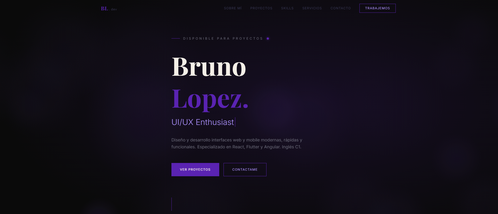

# Bruno Lopez Portfolio

Modern personal portfolio built to showcase my work, skills and professional profile through a clean and interactive user experience.

## Live Demo

[Visit Website](https://bruno-lopez.vercel.app)

## Preview



## Features

- Fully responsive design
- Smooth page transitions and animations
- Modern UI with clean branding
- Projects showcase section
- Contact form with validation
- Optimized performance
- Recruiter-friendly navigation

## Tech Stack

- React
- Vite
- Tailwind CSS
- Framer Motion
- JavaScript
- React Hook Form

## Design Goals

This portfolio was designed with a focus on:

- Strong first impression
- Clean and modern aesthetics
- Smooth user interaction
- Clear presentation of projects and skills
- Fast loading experience

## Author
```text
BL.dev
Bruno Lopez
Frontend Developer focused on building modern digital experiences.
```
